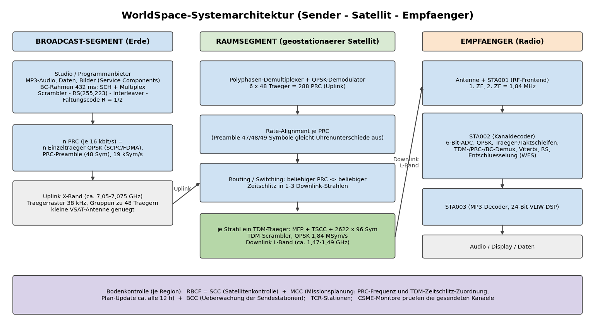
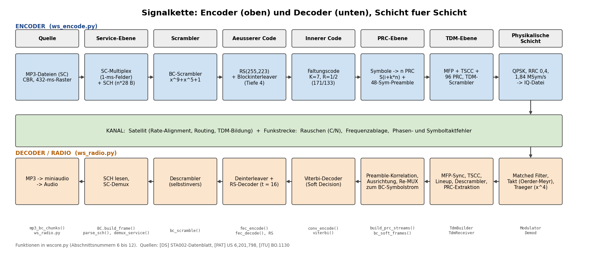
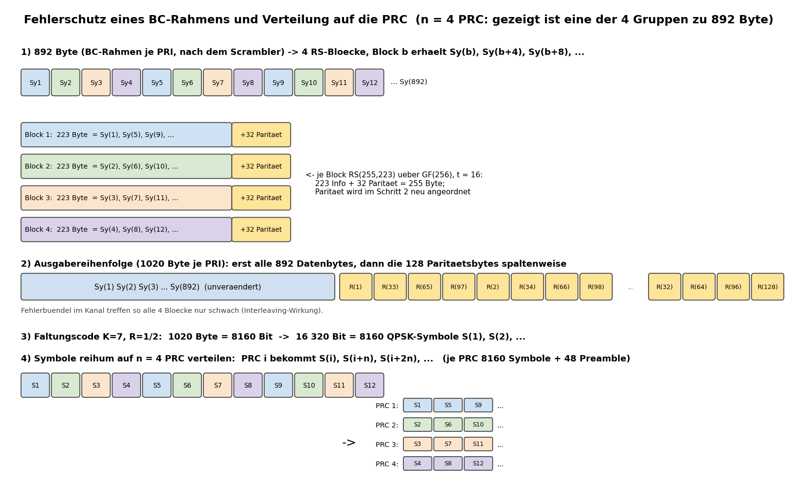
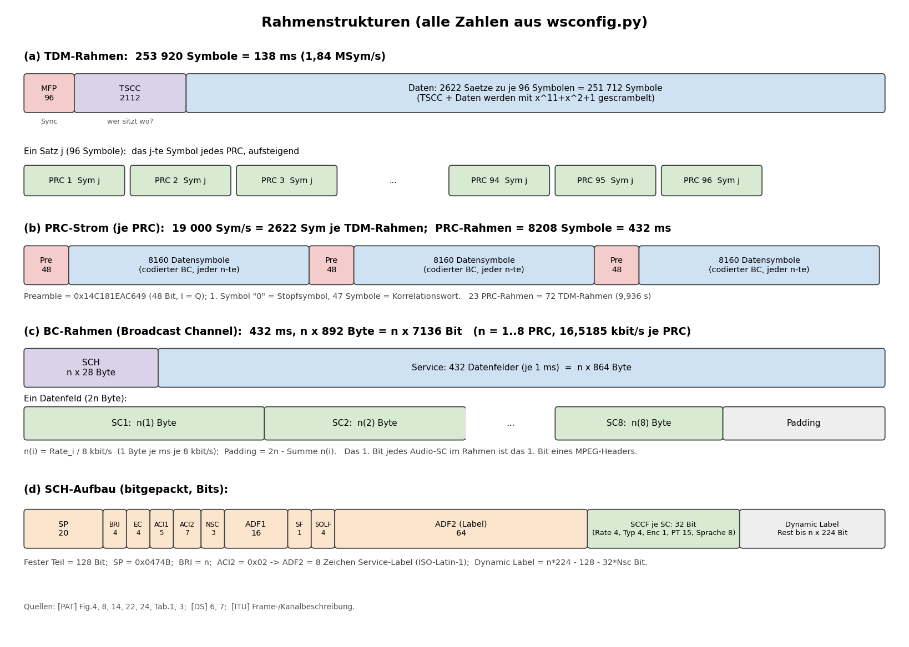

# WorldSpace-Satellitenradio: Encoder und Decoder (Basisband-Simulation)

Ein Python-Nachbau der digitalen Übertragungskette des WorldSpace-Satellitenradios: ein **Encoder**,
der MP3-Programme zu einem Basisband-Signal (komplexe I/Q-Datei) multiplext, und ein **virtuelles
Radio** (Decoder), das aus so einer Datei wieder einen Kanal hörbar macht. Dazu zwei Tk-Oberflächen zur
Vereinfachung der Bedienung.

> **Zweck und Grenzen.** Das Projekt ist ein Lern- und Experimentierwerkzeug auf Basis öffentlich
> zugänglicher Unterlagen (Datenblatt, Patent, ITU-Empfehlung). Es ist **nicht 100% bitgenau zum Original-Signal**:
> Der 96-Bit-MFP-Sync-Wert und einige Konstellations-Details stehen in keiner Unterlage (siehe
> [Abschnitt 7](#7-offene-punkte-und-annahmen)). Die WES-Verschlüsselung ist nicht implementiert.

## Inhalt
1. [Überblick](#1-überblick)
2. [Historie](#2-historie)
3. [Systemtechnik](#3-systemtechnik)
4. [Die Signalkette im Detail](#4-die-signalkette-im-detail)
5. [Projektstruktur und Installation](#5-projektstruktur-und-installation)
6. [Bedienung](#6-bedienung)
7. [Offene Punkte und Annahmen](#7-offene-punkte-und-annahmen)
8. [Tests](#8-tests)
9. [Fehlersuche](#9-fehlersuche)
10. [Quellen](#10-quellen)

---

## 1. Überblick

```
 MP3-Dateien ──► ws_encode.py ──► mux.cs8 (I/Q-Basisband) ──► ws_radio.py ──► Audio (Lautsprecher/WAV/MP3)
   (Service Components)            + mux.cs8.json                 (virtuelles Radio)
```

* **`ws_encode.py`** baut aus bis zu 8 Service Components je Broadcast Channel (BC) und beliebig vielen BC
  einen vollständigen 96-Kanal-TDM-Träger mit 1,84 MSym/s (QPSK) und schreibt ihn als Basisband-Datei.
  Optional lassen sich Kanalstörungen (Rauschen, Frequenz-, Phasen-, Taktfehler) einrechnen.
* **`ws_radio.py`** demoduliert die Datei (Takt- und Trägerrückgewinnung), synchronisiert den Rahmen, liest die
  Kanalbelegung (TSCC), dekodiert den gewählten BC (Viterbi, Reed-Solomon, Descrambler) und liefert die
  gewählte Service Component als MP3-Strom, WAV oder Wiedergabe.
* **`ws_encode_gui.py` / `ws_radio_gui.py`** sind bequeme Bedienoberflächen, die die Konsolenprogramme aufrufen.

---

## 2. Historie

### Die Idee: Satellitenradio für Schwellen- und Entwicklungsländer
WorldSpace Corporation wurde **1990 von Noah Samara** in Washington, D.C. gegründet. Das Ziel war ein
digitales Satelliten-Hörfunksystem für Regionen ohne verlässliches UKW/AM-Netz: Afrika, Asien und den
Mittleren Osten, später auch Lateinamerika. Statt vieler terrestrischer Sender sollte jeder mit einem kleinen
tragbaren Empfänger erreichbar sein. Ein Patent aus dem Umfeld (US 6,201,798, S. J. Campanella u. a.) nennt als
Zielgruppe ausdrücklich die über 4 Milliarden Menschen, die mit Kurzwelle oder reichweitenbegrenztem AM/FM
unterversorgt sind.

### Die Satelliten
* **AfriStar** startete am **28. Oktober 1998** (Ariane, Kourou) und deckt Afrika, den Nahen Osten und
  Südeuropa ab. Der kommerzielle Dienst begann am **1. Oktober 1999**.
* **AsiaStar** folgte am **21. März 2000** für Asien. Der Dienst startete im selben Jahr mit dutzenden
  Programmen.
* **AmeriStar/CaribStar** (Lateinamerika, Karibik) wurden geplant, aber nie gestartet. Die Region
  „CaribStar“ taucht noch im Signalisierungsprotokoll auf (Region-ID im TDM-Identifier).

Die Satelliten tragen einen **bordseitigen digitalen Prozessor**: Er nimmt viele schmalbandige Einzelträger
der Sendestationen entgegen, demoduliert sie, gleicht ihre Symboltakte an und baut daraus die Downlink-
Zeitmultiplexträger. Das war damals eine technische Besonderheit (Details in Abschnitt 3).

### Die Chips: ein IEEE-Meilenstein
Damit Empfänger billig und stromsparend werden, entwickelte **STMicroelectronics** (Standort Agrate Brianza,
Italien) zusammen mit WorldSpace 1996/97 einen **Chipsatz** (laut ETHW-Meilensteinseite „Integrated Circuits for
Satellite Digital Radio, 1996-1997“, IEEE-Meilenstein):

| Chip | Funktion |
|---|---|
| **STA001** | RF-Frontend (Mischer, ZF-Aufbereitung bis 1,84 MHz) |
| **STA002** („STARMAN“) | Kanaldecoder: 6-Bit-ADC, QPSK-Demodulator, TDM-/PRC-/BC-Demux, Viterbi, Reed-Solomon, WES-Entschlüsselung |
| **STA003** | MPEG-Audiodecoder (MP3) auf einem 24-Bit-VLIW-DSP |

Das WorldSpace-System war nach ETHW der erste Dienst, der **MP3 (MPEG-1/2/2.5 Layer III)** im Rundfunk
einsetzte. Die Empfänger kamen unter anderem von Hitachi, JVC, Panasonic und Sanyo.

### Standardisierung und Ende
Das System ist in der **ITU-R-Empfehlung BO.1130** als „Digital System D“ (später „DS“) beschrieben, die
Signalisierung im **US-Patent 6,201,798** (angemeldet 1998). Die Dokumente enthalten die Rahmenstruktur, die
Codes und die Tabellen, auf denen dieses Projekt aufbaut.

Wirtschaftlich blieb WorldSpace hinter den Erwartungen zurück (Schwerpunkt Indien; hohe Kosten, kleine
Abonnentenzahlen). **Im Oktober 2008** beantragte das Unternehmen Gläubigerschutz (Chapter 11). Die Satelliten
wurden später von Nachfolgegesellschaften weitergenutzt, unter anderem für Datendienste und
Rundfunk-Experimente. Das alte Hörfunksystem selbst ist verschwunden. Dieses Projekt hält die Technik
nachvollziehbar fest.

---

## 3. Systemtechnik



### 3.1 Drei Segmente
**Broadcast-Segment.** Jeder Programmanbieter erzeugt einen *Broadcast Channel* (BC) aus
n × 16 kbit/s (*Prime Rate Increments*, PRI), n = 1…8, also 16…128 kbit/s. Der BC wird in 432-ms-Rahmen
verpackt, fehlergeschützt und **symbolweise auf n „Prime Rate Channels“ (PRC) verteilt**. Jeder PRC ist ein
eigener QPSK-Träger (SCPC/FDMA) im X-Band (Raster 38 kHz, Gruppen zu 48 Trägern). So kann sich ein Anbieter
mit einer kleinen VSAT-Antenne begnügen, und der Platz im Satelliten wird flexibel in 16-kbit/s-Schritten
verkauft.

**Raumsegment.** Der Satellit demoduliert alle PRC (288 bis 384 Uplink-Kanäle, je 48 pro Polyphasen-Demux),
gleicht ihre Symboltakte an die Bordzeit an (*Rate Alignment*, siehe PRC-Preamble), schaltet beliebige PRC auf
beliebige Zeitschlitze und bildet daraus pro Downlink-Strahl einen **TDM-Träger mit 96 PRC** (MFP + TSCC +
Daten), QPSK, 1,84 MSym/s, im L-Band (ca. 1,47–1,49 GHz). Pro Satellit gibt es drei Spotbeams. Daneben gibt es
„transparente“ Nutzlasten, die fertig gebildete TDM-Träger nur umsetzen. Gesteuert wird alles von regionalen
Kontrollzentren (RBCF mit SCC, MCC, BCC).

**Empfänger.** Antenne und Frontend (STA001) liefern die 2. ZF bei 1,84 MHz. Der STA002 digitalisiert mit
6 Bit, regelt Träger und Takt (Costas/Frequenz-Phasen-Detektor bzw. Mueller&Müller-Schleifen), synchronisiert
auf den MFP, liest das TSCC, extrahiert die PRC des gewünschten BC, richtet sie über die PRC-Preamble aus und
dekodiert Viterbi → Deinterleaver → Reed-Solomon → Descrambler. Der STA003 decodiert den MP3-Strom.

### 3.2 Wichtige Kennzahlen

| Größe | Wert | Quelle |
|---|---|---|
| Symbolrate Downlink | 1,84 MSym/s, QPSK, RRC-Filter, Roll-off 0,4 | DS S.1, PAT |
| 2. ZF im Empfänger | 1,84 MHz (ADC-Takt = M_CLK/4 ≈ 9,76 MHz) | DS 2, 3 |
| TDM-Rahmen | 253 920 Symbole = 138,0 ms | PAT Fig.8 |
| PRC je TDM-Träger | 96 | DS S.6 |
| PRC-Symbolrate | 19 000 Sym/s (2622 Sym je TDM-Rahmen) | PAT |
| BC-Rahmen | 432 ms, n × 7136 Bit (n × 16,5185 kbit/s brutto) | PAT Sp.7 |
| Fehlerschutz | RS(255,223) + Blockinterleaver (Tiefe 4) + Faltungscode K=7, R=½ | DS 5-6, PAT |
| Netto je PRC | 16,5185 kbit/s inkl. SCH; Audio-SC 8…128 kbit/s in 8er-Schritten | PAT |
| Audio | MPEG Layer III (48/32/24/16/12/8 kHz) | PAT, ITU |
| Synchronisation | MFP (96 Sym), PRC-Preamble (48 Sym), SP (20 Bit) | PAT |

---

## 4. Die Signalkette im Detail



Jede Schicht des Encoders hat im Decoder ihr Gegenstück. Alle Funktionen stehen in `wscore.py`
(dort mit Textbuch-Kommentaren und Quellenangabe, Abschnitte 6 bis 12).

### 4.1 Service-Ebene (Abschnitt 6 in wscore.py)
Ein *Service* besteht aus bis zu 8 *Service Components* (SC), z. B. Audio, Text oder Bild. Jede SC hat eine Rate
als Vielfaches von 8 kbit/s. Zusammen mit dem *Service Control Header* (SCH) entsteht der BC-Rahmen:

* Rahmen alle **432 ms**, bei n PRI genau **n × 892 Byte**: **SCH = n × 28 Byte**, **Service = n × 864 Byte**.
* Der Service-Teil besteht aus **432 Datenfeldern à 1 ms** mit je **2n Byte**: je SC *i* stehen n(i) Byte
  (n(i) = Rate/8 kbit/s) nacheinander im Feld, am Ende Padding. Dadurch ist jede SC über den ganzen Rahmen
  verwoben, und ein Fehlerbündel trifft alle SC gleichmäßig.
* Das **erste Bit eines Audio-SC im Rahmen ist das erste Bit eines MPEG-Frame-Headers.** Deshalb muss die MP3-Quelle
  ins 432-ms-Raster passen (siehe 6.2).
* **SCH-Felder** (bitgepackt, Reihenfolge laut Patent): Service Preamble `0x0474B` (20 Bit), Bit-Rate-Index (4),
  Encryption Control (4), ACI1 (5), ACI2 (7), Zahl der SC−1 (3), ADF1 (16), SF (1), SOLF (4), ADF2 (64 Bit, hier das
  8-stellige **Service-Label**), danach je SC ein 32-Bit-**SCCF** (Rate, Typ, Verschlüsselungsflag, Programmtyp,
  Sprache) und der Rest als **Dynamic Label** (Lauftext).

### 4.2 Transport-Ebene des BC (Abschnitt 7)



1. **Scrambler** x⁹+x⁵+1 (Start 111111111) über den ganzen BC-Rahmen: bricht lange 0/1-Folgen auf; der
   Empfänger addiert dieselbe Folge noch einmal.
2. **Reed-Solomon RS(255,223)** über GF(256): 223 Info- + 32 Paritätsbytes, korrigiert bis zu 16 Bytefehler je
   Block. Je 892 Byte werden **auf 4 Blöcke verteilt** (Block *b* erhält Sy(b), Sy(b+4), …): **Blockinterleaver**
   der Tiefe 4. Ausgabe: erst alle Datenbytes, dann die Parität spaltenweise R(1), R(33), R(65), R(97), R(2), …
3. **Faltungscode** K=7, R=½ (Polynome 171/133 oktal): 1020 Byte = 8160 Bit → 8160 QPSK-Symbole je PRI.
   Der Viterbi-Decoder rechnet mit den analogen I/Q-Werten (*Soft Decision*), das bringt ca. 2 dB Gewinn.
4. **Verteilung auf n PRC:** PRC *i* erhält S(i), S(i+n), S(i+2n), … Jeder PRC bekommt vorn eine
   **48-Symbol-Preamble** (`0x14C181EAC649`, auf I und Q gleich; das erste Symbol ist ein „0“-Stopfsymbol,
   die übrigen 47 dienen der Korrelation). Dadurch ist der PRC-Rahmen 8160 + 48 = **8208 Symbole = 432 ms**.

### 4.3 TSCC und TDM-Rahmen (Abschnitte 8 und 9)



* Der **TDM-Rahmen** hat 253 920 Symbole (138 ms): **MFP** (96 Sym, Synchronwort) + **TSCC** (2112 Sym) + **2622 Sätze**
  zu je 96 Symbolen. Satz *j* enthält das *j*-te Symbol jedes der 96 PRC in aufsteigender Reihenfolge. Das spart im
  Satelliten Speicher und Umschaltaufwand.
* Das **TSCC** („Wer sitzt auf welchem PRC?“) enthält die TDM-ID und 96 *Time Slot Control Words* (BCID-Typ, BCID-Nr.,
  Last-PRC-Flag, Format, Zielgruppe). Es ist doppelt gesichert (RS(255,223) über GF 0x187 und Faltungscode ohne
  Interleaver; Auffüllmuster vorn und hinten).
* TSCC und Daten werden mit einer eigenen Pseudozufallsfolge (x¹¹+x²+1) gescrambelt; der MFP bleibt frei.
* **PRC-Rahmen (432 ms) und TDM-Rahmen (138 ms) laufen nicht synchron.** 23 PRC-Rahmen entsprechen genau 72
  TDM-Rahmen (9,936 s). Der Empfänger richtet sich daher nach der **PRC-Preamble**, nicht nach den TDM-Grenzen.

### 4.4 Physikalische Schicht (Abschnitte 10 und 11)
* **Sender:** QPSK-Symbole → Root-Raised-Cosine-Filter (Roll-off 0,4, 4 Samples/Symbol) → optional Frequenz-,
  Phasen-, Symboltaktfehler und Rauschen → I/Q-Datei.
* **Empfänger** (Feed-Forward statt Regelschleifen, weil dateibasiert): Matched Filter → Taktschätzung
  (Oerder-Meyr: Spektrallinie von |y|²) → kubische Interpolation → Frequenzablage aus der Spektrallinie von z⁴ →
  Restphase blockweise aus arg(−Σz⁴) → Symbole. Die 4-fache QPSK-Phasenmehrdeutigkeit löst der MFP.
  *Q-Inversion* ist beim MFP (I = Q) nicht von einer Drehung um −90° zu unterscheiden; darum entscheidet der
  Empfänger sie über das TSCC (gültiges RS-Codewort).

### 4.5 Quellenverzeichnis nach Funktion

| Funktion | wscore.py | Fundstelle |
|---|---|---|
| RS-Codes (GF 0x11D / 0x187) | `RS`, `RS_BC`, `RS_TSCC` | DS 6.1/6.2; PAT Sp.29, 33 |
| Scrambler | `prs_sequence`, `bc_scramble` | DS 6.3; PAT Fig.16, 27 |
| Faltungscode / Viterbi | `conv_encode`, `viterbi` | DS 5; PAT Fig.21 |
| SCH und Multiplex | `BC.build_sch`, `BC.build_frame`, `parse_sch`, `demux_service` | PAT Tab.1, 3, Fig.14; DS 7 |
| Blockinterleaver | `fec_encode`, `fec_decode` | PAT Fig.19, 20 |
| TSCC | `tscc_encode`, `tscc_decode` | PAT Fig.26, Tab.4, 5 |
| PRC / TDM | `build_prc_streams`, `TdmBuilder` | PAT Fig.4, 8, 22, 24; DS (TDM Demux) |
| Empfänger-Sync | `TdmReceiver` | DS (Frame Sync.); PAT Fig.9-11 |
| MP3-Raster | `mp3_bc_chunks` | PAT Sp.22 |

---

## 5. Projektstruktur und Installation

| Datei | Inhalt |
|---|---|
| `wsconfig.py` | **alle** Konstanten mit Quelle und Belegstatus; Schalter für offene Punkte |
| `wscore.py` | Kernbibliothek mit Lehrbuch-Kommentaren (13 Abschnitte) |
| `ws_encode.py` | Encoder (Konsole) |
| `ws_radio.py` | virtuelles Radio (Konsole) |
| `ws_encode_gui.py`, `ws_radio_gui.py`, `wsgui_common.py` | Tk-Oberflächen |
| `selftest.py` | Ende-zu-Ende-Test mit Kanalstörungen |
| `docs/make_diagrams.py` | erzeugt die Grafiken dieser README |

```bash
pip install numpy scipy miniaudio numba      # numba optional (schnellerer Viterbi), "numpy>=2.1.0,<2.4.0" für ältere Systeme
# Encoder-Umkodierung nutzt ffmpeg (mit libmp3lame) - muss im PATH liegen
# Linux: Tk fuer die GUIs:  sudo apt install python3-tk
```
Python ≥ 3.9. Ohne numba läuft der Viterbi in reinem numpy (deutlich langsamer, aber funktionsgleich).

---

## 6. Bedienung

### 6.1 Schnellstart
```bash
# 1. Multiplex mit zwei Sendern erzeugen (je Sender werden n PRC automatisch berechnet)
python ws_encode.py -o mux.cs8 --bc "Jazz:jazz.mp3@64" --bc "Talk:news.mp3@32@24000,wetter.mp3@24@16000"

# 2. Sender anzeigen
python ws_radio.py mux.cs8 --list

# 3. BCID 1, SC 1 abspielen   (oder:  --wav jazz.wav)
python ws_radio.py mux.cs8 --tune 1.1
```

### 6.2 `ws_encode.py` (Encoder)

```
python ws_encode.py -o AUSGABE --bc "SPEZ" [--bc "SPEZ" ...] [Optionen]
```

#### Pflichtparameter
| Parameter | Bedeutung |
|---|---|
| `-o`, `--out DATEI` | Ausgabedatei (Basisband). Daneben entsteht `DATEI.json` mit Format, Samples/Symbol und Störungen. |
| `--bc "SPEZ"` | Ein Broadcast Channel, **mehrfach** angebbar (siehe unten). |

#### Syntax von `--bc`
```
--bc "[NR=]LABEL:DATEI[@KBPS[@SR]][,DATEI[@KBPS[@SR]]...]"
```
| Teil | Bedeutung |
|---|---|
| `NR=` | BCID 1…510 (optional; Standard: fortlaufend 1, 2, …). 0 = „unbenutzt“, 511 = Testkanal sind reserviert. |
| `LABEL` | Sendername, wird als 8-stelliges Service-Label gesendet (max. 8 Zeichen; ohne `:` `,` `=` `@`). |
| `DATEI` | Audiodatei = eine Service Component (1…8 je BC, durch Komma getrennt). Pfad ohne `,` und `@`. |
| `@KBPS` | Zielbitrate der SC: Vielfaches von 8, 8…128. **Erzwingt die Umkodierung per ffmpeg**, wenn die Datei nicht schon genau so rasterkonform ist. |
| `@SR` | Abtastrate bei der Umkodierung: 48000, 32000, 24000, 16000, 12000 oder 8000. Standard: 48000 Hz Stereo ab 64 kbit/s, sonst 24000 Hz **Mono**. |

Die Zahl der PRC je BC ist **n = aufgerundet(Summe der SC-Raten / 16 kbit/s)**, maximal 8. Insgesamt stehen 96 PRC
zur Verfügung. Ist die Summe ein ungerades Vielfaches von 8 kbit/s, wird mit einem 8-kbit/s-Padding aufgefüllt.

#### Optionen
| Parameter | Standard | Bedeutung |
|---|---|---|
| `--fmt {cs8,cs16,cf32,cu8}` | `cs8` | Sampleformat der Ausgabedatei (siehe 6.7). |
| `--sps N` | 4 | Samples je Symbol (≥ 4; der Empfänger braucht mindestens 4). |
| `--max-seconds S` | ganze Länge | Dauer begrenzen (wird auf ganze 432-ms-Rahmen abgerundet; kürzere Quellen als 0,432 s ergeben einen Fehler). |
| `--loop` | aus | Kürzere SC wiederholen (wie ein Radiosender) statt beim kürzesten SC zu enden. Dauer = längster SC. |
| `--lead-in N` | 1 | Anzahl stummer Vorlauf-BC-Rahmen. Der Empfänger verliert beim Einschwingen den Anfang; der Vorlauf (SC-Typ „ungültig“) puffert das. |
| `--first-prc N` | 0 | Erster belegter PRC (0…95); die BC belegen fortlaufend ab hier. |
| `--cn dB` | aus | Weißes Rauschen mit dem angegebenen C/N (= Es/N0, Definition des Datenblatts). Gut zum Testen: 9, 7, 5, 4 dB. |
| `--cfo Hz` | 0 | Trägerfrequenzablage (z. B. 25000). Der Decoder schätzt sie bis etwa ±0,12 × Symbolrate. |
| `--phase Grad` | 0 | Konstanter Phasenversatz. |
| `--timing T` | 0 | Symboltakt-Versatz in Symbolen (0…1). |
| `--seed N` | 1 | Startwert der Zufallsgeneratoren (Rauschen, Füllsymbole unbenutzter PRC). |
| `--dry-run` | aus | Quellen prüfen/umkodieren und Zusammenfassung ausgeben, **nichts schreiben**. |

#### Das 432-ms-Raster (warum manche MP3 abgelehnt werden)
Jeder BC-Rahmen muss mit einem MPEG-Frame-Header beginnen. Ein Audio-SC mit Rate *r* liefert je Rahmen genau
*r × 54* Byte. Das klappt nur, wenn die MP3
* Layer III mit **konstanter Bitrate ohne Padding** ist (Vielfaches von 8 kbit/s, höchstens 128),
* eine **Abtastrate 48/32/24/16/12/8 kHz** hat (44,1 kHz scheidet aus: 432 ms ist kein ganzzahliges Vielfaches der Framedauer),
* weder ein Xing/Info-Tag noch variable Framelängen enthält.

Passt eine Datei nicht, meldet der Encoder „nicht rasterkonform (…)“ und verlangt `@KBPS`; dann kodiert er
selbst mit ffmpeg (`-map 0:a:0 -vn -map_metadata -1 -codec:a libmp3lame -b:a …k -write_xing 0 -id3v2_version 0`):
nur der erste Audiostream, **ohne Cover und Metadaten**.

Selbst umkodieren geht so (Beispiel 64 kbit/s, 48 kHz Stereo):
```bash
ffmpeg -i quelle.mp3 -map 0:a:0 -vn -map_metadata -1 -ar 48000 -ac 2 -codec:a libmp3lame -b:a 64k \
       -write_xing 0 -id3v2_version 0 ziel.mp3
```

#### Beispiele
```bash
# Prüfen ohne zu schreiben
python ws_encode.py -o mux.cs8 --bc "Radio:1.mp3@48" --bc "RadioK2:2.mp3@48" --dry-run

# Zwei Sender, Sender 2 mit zwei Service Components, auf BCID 7 und 12
python ws_encode.py -o mux.cs8 --bc "7=Jazz:jazz.mp3@64" --bc "12=Talk:news.mp3@32@24000,wetter.mp3@24@16000"

# Test mit Störungen: 6 dB C/N, 12 kHz Frequenzfehler, 40 Grad Phase, 0,5 Symbol Taktversatz, nur 20 s
python ws_encode.py -o test.cs8 --bc "Jazz:jazz.mp3@64" --cn 6 --cfo 12000 --phase 40 --timing 0.5 --max-seconds 20

# Kleine Datei: 16-Bit-IQ, kürzere Quelle wiederholen
python ws_encode.py -o mux.cs16 --fmt cs16 --loop --bc "Jingle:jingle.mp3@32@24000" --bc "Musik:musik.mp3@64"
```

### 6.3 `ws_radio.py` (virtuelles Radio / Decoder)

```
python ws_radio.py DATEI [Optionen]
```
Ohne `--list` und `--tune` startet der **interaktive Modus**.

| Parameter | Bedeutung |
|---|---|
| `DATEI` | Basisband-Datei. Format und Samples/Symbol kommen aus `DATEI.json` (vom Encoder), sonst Standardwerte `cs8`, 4. |
| `--fmt {cs8,cs16,cf32,cu8}` | Format erzwingen (nötig für Dateien ohne `.json`). |
| `--sps N` | Samples/Symbol erzwingen. |
| `--list` | Senderliste ausgeben und beenden. |
| `--tune BCID[.SC]` | Auf BCID und SC abstimmen (SC-Nr. ab 1; ohne Angabe SC 1). Standard: **Lautsprecher**. |
| `--wav DATEI` | Audio in eine WAV-Datei schreiben (statt abspielen). |
| `--out-mp3 DATEI` | Rohen Datenstrom der SC (MP3 bzw. bei Datendiensten die Rohdaten) speichern. |
| `--salvage` | Auch BC-Rahmen mit nicht korrigierbaren RS-Fehlern verwenden (sonst werden sie verworfen). |
| `--json` | Maschinenlesbar: Logs auf stderr, Ergebnis als Zeile `@@JSON@@ {...}` (nutzen die GUIs). |
| `--cache DATEI` | Pfad des Symbol-Caches (Standard: `DATEI.syms`). |

**Ablauf:** Beim ersten Aufruf wird die Datei **demoduliert** (Fortschrittsanzeige) und ein Symbol-Cache
(`DATEI.syms` + `.syms.meta`, ca. 14,7 MB je Sekunde Signal) angelegt. Spätere Aufrufe sind dadurch schnell.
Der Cache wird neu erzeugt, wenn sich die Basisdatei, Format/sps oder der MFP (`wsconfig.py`) ändern.

**Interaktive Befehle**

| Befehl | Wirkung |
|---|---|
| `l` | Senderliste |
| `i` | Signalinfo (TDM-Rahmen, C/N, Sync-Güte, belegte PRC) |
| `t BCID[.SC]` | Abstimmen und abspielen |
| `w BCID.SC DATEI.wav` | Als WAV speichern |
| `q` | Beenden |

**Hinweise:** `--tune` ohne `--wav`/`--out-mp3` spielt über miniaudio; ist kein Audiogerät nutzbar, wird
stattdessen `bcX_scY.wav` geschrieben. Verschlüsselte SC werden abgelehnt (WES nicht implementiert). Der Rückgabewert ist
0 bei Erfolg, sonst ≠ 0 mit Fehlermeldung.

**Beispiele**
```bash
python ws_radio.py mux.cs8 --list
python ws_radio.py mux.cs8 --tune 2.2 --wav wetter.wav
python ws_radio.py mux.cs8 --tune 1 --out-mp3 jazz.mp3
python ws_radio.py aufnahme.cs16 --fmt cs16 --sps 4 --list      # Datei ohne .json
```

### 6.4 Grafische Oberflächen

```bash
python ws_encode_gui.py              # Encoder
python ws_radio_gui.py [DATEI]       # Radio (optional mit Datei, scannt sofort)
```
Die GUIs enthalten **keine** eigene Signalverarbeitung: Sie bauen die Kommandozeile und starten
`ws_encode.py` bzw. `ws_radio.py` als Unterprozess. Die Ausgabe erscheint live im Protokoll (mit Fortschrittsbalken).

**Encoder-GUI**
1. **Broadcast Channels:** „Neuer BC …“ legt BCID, Namen und 1–8 Service Components an. Je SC: Datei, Bitrate
   („Datei übernehmen“ nur bei rasterkonformen MP3), Abtastrate. Die GUI zeigt sofort PRC je BC, PRC-Summe, Dauer
   und Dateigröße.
2. **Ausgabe:** Zieldatei, Format, Samples/Symbol, max. Sekunden, Vorlauf, erster PRC, „Kürzere SC wiederholen“;
   **Kanalstörungen** zum Testen.
3. **Befehl und Start:** Die Kommandozeile ist sichtbar und kopierbar. „Prüfen (Trockenlauf)“, „Encoder starten“,
   „Abbrechen“, „Im Radio öffnen“. Projekte als `.wsproj` speichern/laden (Menü Datei).

**Radio-GUI**
1. Datei wählen (Format/sps unter „Erweitert“ nur bei Dateien ohne `.json`), **Scannen**.
2. Der Baum zeigt BCID → Name → SC mit Bitrate, Typ, PRC und Rahmenstatistik (z. B. „5/5 Rahmen ok“); oben
   C/N, TDM-Rahmen, Sync-Güte. Unter dem Baum das Dynamic Label.
3. **Doppelklick** oder „Abspielen“: Pause, Suchleiste, Lautstärke. „WAV speichern …“ und „SC-Rohdaten (MP3)
   speichern …“. „Cache neu erzeugen“ erzwingt neue Demodulation; Menü „Konfiguration“ zeigt die offenen
   Schalter aus `wsconfig.py`.

### 6.5 `selftest.py`
```bash
python selftest.py
```
Erzeugt Test-MP3 (benötigt ffmpeg), kodiert 7 Szenarien (sauber; C/N 9 dB; Frequenz +25 kHz und 37° Phase; Takt 0,37;
Kombination C/N 7 dB, −18 kHz, 120°, 0,5 Symbol; C/N 5 dB; C/N 4 dB), dekodiert sie und vergleicht die SC-Ströme
**Byte für Byte** mit der Quelle. Dauer einige Minuten, Rückgabewert 0 = bestanden.

### 6.6 Konfiguration (`wsconfig.py`)
Alle Konstanten stehen in `wsconfig.py` (mit Quelle). Die Schalter in **Abschnitt 4** betreffen Encoder **und**
Decoder und müssen auf beiden Seiten gleich sein. Nach einer Änderung neu scannen (Cache neu erzeugen).

| Schalter | Standard | Bedeutung |
|---|---|---|
| `MFP_HEX` | `None` (Platzhalter) | 24 Hexzeichen = 96-Bit-MFP-Sync-Wert; **wichtigster Schalter für echte Aufnahmen** |
| `BIT0_POSITIVE` | `True` | Bit 0 → positive Amplitude |
| `CONV_FIRST_BIT_TO_I` | `True` | erstes Codebit (g1) → I-Kanal |
| `CONV_INVERT_G2` | `True` | g2-Zweig invertiert (nach Fig. 21) |
| `CONV_MODE` | `reset_per_frame` | oder `continuous`: Zustand des Faltungscodierers zwischen BC-Rahmen |
| `BC_SCRAMBLE_SKIP_BITS` | `0` | 0 = ab erstem Bit (Text), 80 = „alle außer den ersten 80 Bit“ (Fig. 13A) |
| `INTERLEAVE_SCOPE` | `per_pri` | oder `whole_bc`: Interleaver-Bereich bei n > 1 |
| `PRS_OUT_LAST_STAGE` | `True` | Abgriff der Pseudozufallsfolgen |
| `TDM_ID_RESERVED_BITS` | 8 | Auffüllung der TDM-ID auf 16 Bit |
| `SERVICE_PAD_BYTE` | `0x00` | Inhalt des Padding |
| `UNUSED_PRC_FILL` | `random` | Inhalt unbenutzter PRC |

### 6.7 Dateiformate und Größen
Basisband-Dateien sind **interleaved I/Q** (I, Q, I, Q, …). Die Größe ist
*Samples/Symbol × 1,84 MSym/s × Bytes je Sample*:

| Format | Bytes je I/Q-Sample | Bei 4 Samples/Symbol |
|---|---|---|
| `cs8` (int8) | 2 | ≈ **14,7 MB je Sekunde** (≈ 880 MB je Minute) |
| `cu8` (uint8, RTL-SDR-Stil) | 2 | ≈ 14,7 MB/s |
| `cs16` (int16) | 4 | ≈ 29,4 MB/s |
| `cf32` (float32) | 8 | ≈ 58,9 MB/s |

Der Symbol-Cache (`.syms`) braucht zusätzlich ca. 14,7 MB je Sekunde. Der Encoder gibt die erwartete Größe
im Trockenlauf aus (`--dry-run`). Für lange Tests `--max-seconds` und kleine Formate nutzen.

---

## 7. Offene Punkte und Annahmen

Belegt (direkt aus DS/PAT/ITU) sind die Rahmenstrukturen, Codes, Polynome, Preambles und Feldbreiten (Abschnitt 4).
**Nicht** in den Unterlagen steht:

| Punkt | Behandlung |
|---|---|
| 96-Bit-**MFP-Sync-Wert** | Platzhalter; `MFP_HEX` setzen. Ohne den richtigen Wert findet der Decoder kein echtes Signal. |
| Konstellationszuordnung, I/Q-Reihenfolge | Schalter `BIT0_POSITIVE`, `CONV_FIRST_BIT_TO_I` |
| Inverter im g2-Zweig | Schalter `CONV_INVERT_G2` (Fig. 21 zeigt einen Inverter, der Text ist unklar) |
| Faltungscode-Zustand zwischen BC-Rahmen | Schalter `CONV_MODE` |
| Scrambler-Beginn | Schalter `BC_SCRAMBLE_SKIP_BITS` (Text ↔ Fig. 13A widersprüchlich) |
| Interleaver bei n > 1 | Schalter `INTERLEAVE_SCOPE` |
| TDM-ID: 14 oder 16 Bit | auf 16 aufgefüllt |
| Padding- und Füllmuster | frei wählbar, ohne Wirkung auf die Dekodierung |
| WES-Verschlüsselung | nicht implementiert (Algorithmus nicht öffentlich) |

Alle Schalterkombinationen sind in sich konsistent getestet (Encoder und Decoder zusammen). Ob eine Kombination zu
einem echten Signal passt, lässt sich nur mit einer echten Referenzaufnahme des Satelliten aus der Betriebszeit
des Worldspace-Systems entscheiden, nur diese wurde bis jetzt in keinem Archiv im Internet gefunden.

---

## 8. Tests

* `selftest.py`: sieben Kanalszenarien, SC-Ströme bitgleich zur Quelle (Details in 6.5).
* Alle Schalter aus 6.6 zusätzlich als Digital-Loopback (Encoder → Decoder ohne HF).
* GUIs unter einem virtuellen Display durchgespielt (Trockenlauf, Encoder-Lauf, Scan, Abspielen-Job, WAV-/MP3-Export).
* Nicht getestet: Wiedergabe über echte Soundkarte (WAV-Pfad getestet), Taktdrift (ppm), reale SDR-Aufnahmen,
  PRC-Preambles mit 47/49 Symbolen (der Decoder korreliert nur das 47-Symbol-Wort, der Encoder sendet immer 48).

---

## 9. Fehlersuche

| Meldung / Symptom | Ursache und Lösung |
|---|---|
| `Attached pictures were requested, but the ID3v2 header is disabled` (ffmpeg, Code 234) | Die Quell-MP3 enthält ein **Cover-Bild**; ffmpeg wollte es mitkopieren, der ID3-Header ist aber abgeschaltet. Behoben: Der Encoder nutzt `-map 0:a:0 -vn -map_metadata -1` (nur Audio, kein Bild, keine Metadaten). |
| `nicht rasterkonform (keine konstante Bitrate …)` | VBR oder Padding im Strom: `@KBPS` angeben, dann kodiert der Encoder um. |
| `nicht rasterkonform (Abtastrate 44100 Hz nicht erlaubt …)` | 44,1 kHz passt nicht ins 432-ms-Raster: `@KBPS@SR` mit 48000/32000/24000/… angeben. |
| `ffmpeg nicht gefunden` | ffmpeg installieren (mit libmp3lame) oder selbst umkodieren (siehe 6.2). |
| `Keine vollständigen BC-Rahmen` | Quelle kürzer als 432 ms oder `--max-seconds` zu klein. |
| `Kein MFP gefunden` (Radio) | Kein Signal, falsches `--fmt`/`--sps` oder **falscher MFP** (`MFP_HEX` in Encoder und Decoder gleich?). |
| Sender erscheinen, aber „0/N Rahmen ok“ | Codierungs-Schalter (Abschnitt 6.6) in Encoder und Decoder verschieden, oder C/N zu niedrig (unter ca. 4 dB). |
| Stille nach Abstimmen | SC ist ein Datendienst/„ungültig“ (Vorlauf) oder verschlüsselt. Typ in der Senderliste prüfen. |
| Sehr langer erster Scan | Demodulation in Python; Cache beschleunigt weitere Aufrufe. numba beschleunigt den Viterbi. |

---

## 10. Quellen

* **[DS]** STMicroelectronics, *STA002 STARMAN Channel Decoder*, Datenblatt, Jan. 2002 (43 Seiten); ältere Fassung 1999 und
  *STA002 QPSK Implementation Note* (1997), verlinkt auf der ETHW-Meilensteinseite.
* **[PAT]** S. J. Campanella et al., *Signaling Protocol for Satellite Direct Radio Broadcast System*, US 6,201,798 B1
  (13.03.2001), WorldSpace Management Corporation.
* **[ITU]** ITU-R Recommendation BO.1130 (digitale Satelliten-Tonrundfunksysteme; Systeme A, B, D/DS, E), hier System D/DS = WorldSpace, Fassungen -3 und -5.
* **ETHW** *Milestones: Integrated Circuits for Satellite Digital Radio, 1996-1997*, Engineering and Technology History Wiki (IEEE-Meilenstein).
* Historische Eckdaten (Gründung, Starttermine, Insolvenz): Pressemeldungen und Übersichtsartikel zu WorldSpace/AfriStar/AsiaStar
  (u. a. Wikipedia, Radio World 2000, Fachpresse 2008).
